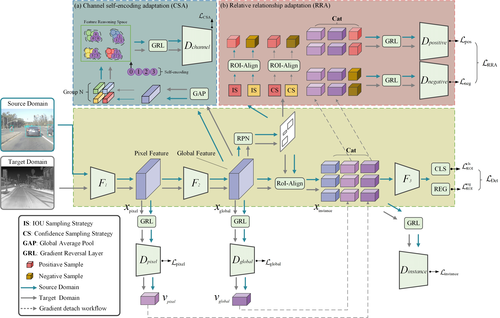

# Domain Adaptive Thermal Object Detection with Unbiased Granularity Alignment


 


<div align=center>
  
</div>


---
### RGB-to-RGB Benchmark：

[Cityscape-to-Foggycityscape branch](https://github.com/zyfone/UGA/tree/visible-to-visible) 


## Requirements
* Ubuntu 18.04.5 LTS
* Python 3.6
* [CUDA 10.0](https://developer.nvidia.com/cuda-toolkit)
* [PyTorch 1.0.0](https://pytorch.org)
* [Faster R-CNN](https://github.com/jwyang/faster-rcnn.pytorch/tree/pytorch-1.0)


## dataset download

We also provide the download URL of the dataset in the future.

[Dataste Download](https://github.com/AmineMarnissi/UDAT)


## Compile the code

Compile the cuda dependencies using following simple commands following [Faster R-CNN](https://github.com/jwyang/faster-rcnn.pytorch/tree/pytorch-1.0):
```bash
cd lib
python setup.py build develop
```

## Pre-trained Models


* **ResNet101:** [Dropbox](https://www.dropbox.com/s/iev3tkbz5wyyuz9/resnet101_caffe.pth?dl=0)  [VT Server](https://filebox.ece.vt.edu/~jw2yang/faster-rcnn/pretrained-base-models/resnet101_caffe.pth)

## Training and Test

Train the model

```bash
sh ./train_scripts/train_flir.sh
```

Test the well-trained model:
```bash
python test_scripts/test_flir.py
```


## :pencil:Related repos
Our project references the codes in the following repos:

* Megvii-Nanjing, [CR-DA-DET](https://github.com/Megvii-Nanjing/CR-DA-DET)


other code :
* https://github.com/tiancity-NJU/da-faster-rcnn-PyTorch
* https://github.com/MCG-NJU/TIA/
* https://github.com/harsh-99/SCL
* https://github.com/AmineMarnissi/UDAT


if you have any questions , please contact me at 478756030@qq.com


```BibTeX
@article{10.1145/3665892,
author = {Shi, Caijuan and Zheng, Yuanfan and Chen, Zhen},
title = {Domain Adaptive Thermal Object Detection with Unbiased Granularity Alignment},
year = {2024},
doi = {10.1145/3665892},
journal = {ACM Trans. Multimedia Comput. Commun. Appl.},
}
```
